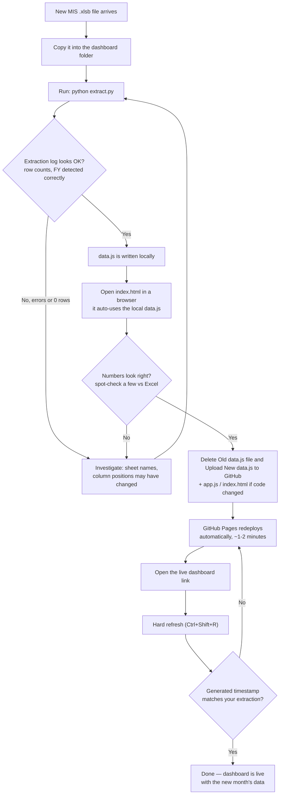

# Revenue MIS Dashboard — Standard Operating Procedure

**Audience:** Anyone taking over, maintaining, or extending this dashboard who has never seen the code before.
**Last verified:** 2026-07-03, against source file `MIS FINCART FY- 2026-2027_29 Jun-26 - (4).xlsb`.

---

## 1. What this dashboard is for

This is a web-based reporting dashboard for Fincart's Revenue MIS (Management Information System). It turns one large, complex Excel workbook (`.xlsb` — Excel Binary format) that the operations team maintains into a fast, filterable, always-up-to-date web page that anyone (sales leadership, RMs, finance) can open in a browser — no Excel needed.

It answers questions like:
- How much total revenue has the company made this month / this year, broken down by product line (Insurance, Fees, PMS, MF Trail)?
- Which RMs (Relationship Managers) are generating the most revenue, and how does that compare to their targets?
- How is each team performing?
- What does the raw underlying data look like, if someone wants to drill into a specific policy, transaction, or RM?

It is **not** a system of record — the Excel file is the source of truth. This dashboard only reads and displays it.

---

## 2. How to use the dashboard (end-user guide)

This section assumes no technical knowledge — it's for anyone who just wants to look at the numbers.

### 2.1 Opening it
Open the GitHub Pages link in any browser (desktop or mobile). It needs an internet connection even after the page loads, because it pulls in some charting libraries live. Give it a few seconds on first load — a spinner and a status message ("Loading data…", "Downloading…", etc.) show what it's doing.

### 2.2 The header bar (visible on every tab)
- **Logo + title**, and directly under it the **source file name and a "Generated: …" timestamp** — this tells you exactly which Excel file the numbers came from and when it was last processed. Always check this if a number looks stale.
- **MONTH filter** — narrows every chart/table on the page to one specific month, or "All Months" for the full fiscal year so far.
- **TEAM filter** — narrows everything to one team (e.g. "Ratan P", "Akanksha"), or "All Teams".
- **↑ Re-upload .xlsb** — lets you manually pick a `.xlsb` file from your own computer and load it straight into the browser, bypassing GitHub entirely. Useful if you have a newer file than what's published, or if GitHub is down. (This does the same job as `extract.py`, just inside the browser — see Section 5.)

### 2.3 The tabs
Six tabs across the top, each covering a different slice of the data:

| Tab | What it's for |
|---|---|
| 📊 Dashboard | Company-wide headline numbers and trends — the "start here" view |
| 📋 Revenue Summary V2 | Per-RM target vs achievement scorecard |
| 🛡️ INS — Insurance | Everything about insurance policies |
| 💰 FEES | Everything about financial-planning fee income |
| 📈 PMS | Everything about Portfolio Management Services |
| 📞 Talk — RM Performance | Per-RM activity metrics (calls, net sale, SIP, clients) |

### 2.4 Inside a tab
- **KPI cards** at the top — the big headline numbers for that tab.
- **View buttons** (a row of pill-shaped buttons, e.g. "🏅 RM Analysis / 📦 Product Breakdown / 📅 Monthly Trend / 🔍 Raw Data") — switch between different angles on the same tab's data.
- **Charts and tables** below, which update instantly whenever you change the Month filter, Team filter, or a view button.
- **The "i" info button** next to almost every chart/table title — click it any time you want to know exactly which Excel sheet and column a number came from. This is the fastest way to answer "where does this number come from?" without asking anyone.

### 2.5 Special controls to know about
- **Dashboard tab — MTD / YTD toggle:** switches the top KPI cards between "this month only" and "full year so far".
- **INS / FEES / PMS → Monthly Trend → Day Window:** two number boxes ("Day ⬜ to ⬜") let you compare the same slice of every month — e.g. entering 1 and 11 shows only transactions created on the 1st–11th of each month, so you can fairly compare "early April" against "early May" instead of full months of different lengths so far.
- **Sortable table headers:** on the "RM Rankings — Full List" tables, click any column header to sort by it (click again to reverse). Note: the **rank number in the leftmost column always reflects revenue rank**, even if you've sorted the table by a different column — it won't renumber to 1, 2, 3 just because you re-sorted.
- **INS → Raw Data → per-column filters:** click the little ▼ next to any column header to open an Excel-style filter menu — tick/untick specific values, or type text to search "contains". FEES and PMS's Raw Data views instead have one simple global search box at the top.

### 2.6 If something looks wrong
1. Check the "Generated:" timestamp in the header — is it as recent as you expect?
2. Try a hard refresh (`Ctrl+Shift+R` on Windows) — this clears any cached old version of the page.
3. Click the relevant "i" info button to see what data is actually feeding that number, then see Section 8 for how to manually verify it in Excel.

---

## 3. How the dashboard gets created / refreshed — flowchart

This is the process someone (usually you) runs every time a new month's MIS Excel file is ready. It's described in full detail in Section 9; this is the quick visual version.



**In plain steps, if the diagram doesn't render wherever you're reading this:**

1. Drop the new `.xlsb` file into the dashboard folder.
2. Run `python extract.py` — wait ~40–60 seconds.
3. Check the printed log: row counts per sheet, and confirm the fiscal year it detected looks right.
4. Open `index.html` locally and spot-check a couple of numbers against the Excel file.
5. Delete the Old `data.js` file and Upload the new `data.js` (and `app.js`/`index.html` if any code changed) to the GitHub repo.
6. Wait a minute or two for GitHub Pages to redeploy, then hard-refresh the live link.
7. Confirm the "Generated" timestamp on the live page matches what you just ran.

---

## 4. What input the engine expects

### 4.1 The source file
A single `.xlsb` file, e.g. `MIS FINCART FY- 2026-2027_29 Jun-26 -.xlsb`, containing these exact sheet names (case- and space-sensitive):

| Sheet name | What it holds |
|---|---|
| `INS` | Every insurance policy row (raw transactional data) |
| `FEES` | Every financial-planning fee transaction |
| `PMS` | Every Portfolio Management Services transaction |
| `Talk` | Per-RM monthly call/activity metrics (Net Sale, SIP, PMS, Clients, Talktime) |
| `REVENUE SUMMARY V 2.0` | Per-RM KRA scorecard: revenue target vs achievement, AUM, clients, SIP, etc. for both MTD and YTD |
| `REVENUE REPORT MONTHLY` | Per-RM reconciled revenue broken into Fees / Insurance / PMS / MF Trail for the current month |
| `REVENUE REPORT YTD` | Same reconciled breakdown, but year-to-date |

The dashboard reads these sheets **by exact name** and by **fixed column position** (e.g. "column 52 is Revenue" in the INS sheet). If the workbook's sheet names or column order ever change, the code must be updated to match (see Section 10, "Known drawbacks and gotchas").

### 4.2 Row filtering rules baked into the engine
- **B2C only.** Every row in `INS`, `FEES`, `PMS` has a "B Type" column. Only rows marked exactly `B2C` are kept — B2B rows are dropped for those three raw sheets. (Note: the *Dashboard's* top KPIs use `REVENUE REPORT MONTHLY/YTD` instead, which has its own Team column, and there the engine explicitly excludes any row where `Team = B2B` — see Section 7.)
- **Current fiscal year only.** `INS`/`FEES`/`PMS` rows whose Month column falls outside the current FY (Apr → Mar) are dropped. This is how last year's leftover/legacy rows are excluded.
- **Pool rows excluded from KPIs.** Some rows represent an unassigned "pool" of clients (name starts with "Pool…", e.g. `PoolAK`) rather than a real RM. These are excluded from Revenue Summary and from the Dashboard's reconciled KPIs, matching how Excel's own summary treats them.

### 4.3 What the engine does NOT need from you
- You do **not** need to manually specify the fiscal year, the current month, or the list of RMs/teams — all three are **auto-detected** from the file every time it's processed (see Section 6).
- You do **not** need to tell it about new RMs, new insurance types, new partners, etc. — every list/filter/chart is built dynamically from whatever values exist in the data.

---

## 5. System architecture — the moving parts

There are exactly **four files** that matter, plus one folder of dependencies loaded from the internet (Chart.js, SheetJS). Everything lives in:

```
C:\Users\Dev Singhal\Desktop\MIS FINCART\New Revenue MIS (Dashboard)\
```

| File | Role |
|---|---|
| `extract.py` | A **Python script you run manually** on your own PC. It opens the `.xlsb` in Excel (via Windows COM automation), reads the 7 sheets above, and writes everything out as one compact `data.js` file. |
| `data.js` | The **output** of `extract.py`. A plain JavaScript file containing one line: `window.REVENUE_DATA = { ... a big JSON object ... };`. This is the actual data the dashboard displays. |
| `index.html` | The page skeleton — the static HTML structure (header, tab buttons, empty containers that JavaScript will fill in), plus the CSS styling. |
| `app.js` | All the logic. Fetches/loads the data, filters it, computes every KPI/chart/table, and renders the whole interactive interface into the empty containers `index.html` provides. |

### 5.1 Two ways the dashboard gets its data

**Path A — GitHub Pages (the live, shareable link).**
When someone opens the GitHub Pages URL, `app.js` calls `loadFromGitHub()` which fetches `data.js` directly from the GitHub repo (`raw.githubusercontent.com/.../data.js`) over the internet. This is fast (~2 MB file) and requires no Excel on the viewer's machine. **This only works if `data.js` (and `app.js`/`index.html`) are actually present in the GitHub repo** — see the warning at the top of this document.

**Path B — Local testing (on your own PC).**
If you open `index.html` directly in a browser, or run it via `localhost`, `app.js` detects this (`isLocal` check) and instead uses whatever `data.js` sits in the same folder — i.e. the one you just generated with `extract.py`, before uploading anything. This lets you preview new data before publishing it.

**Fallback.** If Path A fails (GitHub unreachable, file missing, etc.) but a local `data.js` was also loaded onto the page via a `<script>` tag, the dashboard falls back to that instead of showing a blank error screen.

### 5.2 Why Python + Excel COM, not a pure-JS parser?
`.xlsb` is a binary Excel format that's hard to parse quickly in a browser at this file's size (~20 MB). `extract.py` instead automates a real copy of Microsoft Excel in the background (invisible, no dialogs) to open the file and read cell ranges — this is fast and 100% faithful to what Excel itself sees, including formulas' calculated results. The output is a small, plain-JSON `data.js` that any browser can parse instantly.

There is also a **secondary, in-browser parser** inside `app.js` (`parseWorkbook()`, using the SheetJS library) that mirrors the Python logic. This exists for the manual "↑ Re-upload .xlsb" button in the header, so someone without Python/Excel installed can still refresh the dashboard by uploading the file straight into the browser. It applies the exact same column mappings and filters as `extract.py` — the two are meant to be kept in sync (see Section 10.3).

---

## 6. How it computes things — the mechanics

### 6.1 Dynamic fiscal-year detection
Both `extract.py` and `app.js` read cell **D1** of the `REVENUE SUMMARY V 2.0` sheet, which contains a label like `"JUN-2026"`. From this single string, the code derives:
- Which calendar year the fiscal year started in (April onwards = same year; Jan/Feb/Mar = previous year — because the Indian FY runs April→March).
- The full ordered list of 12 FY months, e.g. `Apr-2026, May-2026, …, Mar-2027`.

This list is used everywhere: to filter out pre-FY rows, to order every "by month" chart/table correctly (not alphabetically), and to know which months to even show (only months that actually have data appear — new months added to the source file appear automatically the next time data is refreshed).

*(Function names: `fy_months_from_label()` in `extract.py`; `fyFromMtdMonth()` in `app.js`.)*

### 6.2 RM → Team resolution
The raw `INS`/`FEES`/`PMS` sheets only record the RM's *name*, not their team. Team names live in the `Talk` sheet. So the dashboard builds a lookup dictionary once per page load: `{ rm name (lowercased, trimmed) → team }`, from every row of `Talk`. Every "Team" column and every Team filter anywhere in the dashboard uses this lookup (`teamOf()` function). If an RM's name is spelled slightly differently between `INS` and `Talk` (extra space, nickname, etc.), they'll show as **"Unassigned"** — this is the single most common data-quality gotcha (see Section 10.5).

### 6.3 MTD vs YTD toggle (Dashboard tab)
The top of the Dashboard tab has an MTD/YTD switch. Selecting it swaps between two independent, pre-computed data blocks: `REVENUE REPORT MONTHLY` (this month only) and `REVENUE REPORT YTD` (full year so far). These come straight from the two like-named Excel sheets — the dashboard does not compute MTD/YTD itself; Excel already reconciles this.

### 6.4 The MTD "Day Window" filter (INS / FEES / PMS → Monthly Trend)
On each product tab's Monthly Trend view, there's a "Day 1 to Day 11" style filter (mirroring the Marketing MIS dashboard). This filters transactions by the **day-of-month of their Create Date** (not the revenue month) — so entering 1–11 shows only transactions created on the 1st through 11th of each month, letting you compare "the first 11 days of April" against "the first 11 days of May" fairly. This uses a `createDate` field (format `YYYY-MM-DD`) extracted from a dedicated CREATEDATE column in each sheet.

### 6.5 Team filter vs. B2B/Pool exclusion — two different things, don't confuse them
- The **header Team dropdown** (All Teams / Akanksha / Ratan P / etc.) is a manual filter the *user* controls. It affects almost every tab.
- Separately, the **Dashboard's reconciled KPIs** (Total/Insurance/Fees/PMS/Trail Revenue cards) *always* silently exclude `Team = B2B` rows and "pool" rows, regardless of what the user picks in the Team dropdown, because that's how `REVENUE SUMMARY V 2.0`'s own grand-total row is built, and the dashboard is designed to match that number exactly (see Section 8).

### 6.6 Fixed RM ranking
On every "RM Rankings — Full List" table, the `#` rank column is calculated **once**, by revenue, and stored per-RM (`assignRevRank()`). This means if you click a column header to sort the table alphabetically or by team, RM #1 (by revenue) keeps showing "1" in the rank column — the rank doesn't renumber to match whatever sort order the table currently displays.

### 6.7 Caching
The GitHub fetch appends a `?t=<timestamp>` cache-buster and sends `cache: 'no-store'`, specifically so that after you upload a fresh `data.js` to GitHub, viewers see the new numbers immediately rather than a cached (stale) copy for a few minutes.

---

## 7. What it computes — tab by tab

### 📊 Dashboard
- **MTD/YTD toggle** — see 6.3.
- **Top KPI cards:** Total Revenue, Insurance Revenue, FEES Revenue, PMS Revenue, Trail Revenue (MF), RMs Reporting. Sourced from `REVENUE REPORT MONTHLY`/`YTD`, **excluding B2B and pool rows** (see 6.5), and further narrowed if a Team filter is applied.
- **Second KPI row:** Net Sale YTD, SIP Book YTD, Clients Added YTD, Active RMs — all sourced from the `Talk` sheet (independent of the reconciled report above).
- **3 monthly trend charts** (Insurance / FEES / PMS) — from the raw `INS`/`FEES`/`PMS` sheets (not the reconciled report), respecting Month/Team filters.
- **Revenue by Team table** and **Revenue by Month table** — also from raw `INS`/`FEES`/`PMS`.

⚠️ Note the inconsistency: the top KPI cards use the *reconciled* report (excl. B2B/pool), but the trend charts/tables below them use the *raw* sheets (incl. B2B, incl. pool). This means the KPI cards and the charts underneath will not always add up to the same number — this is a known limitation, not a bug (see Section 10.4).

### 📋 Revenue Summary V2
A near-direct mirror of the `REVENUE SUMMARY V 2.0` sheet: per-RM KRA scorecard (Revenue Target vs Achievement, AUM, MF Net Sale, SIP, Clients, Greentape Time), toggleable between MTD and YTD, filterable by team. Includes a Top-15-RMs chart color-coded by % achievement (green ≥80%, yellow 50–79%, red <50%).

### 🛡️ INS / 💰 FEES / 📈 PMS (structurally identical)
Each has 4–5 views selectable via a pill bar:
1. **RM Analysis** — Top 15 RMs chart, Revenue-by-Team chart, and a sortable, fixed-rank Full List table.
2. **Product/Asset/Partner Breakdown** — revenue split by product type / insurance category / partner / asset / scheme, depending on the tab.
3. **Monthly Trend** — the Day-Window MTD filter (6.4), a monthly chart, and a monthly breakdown table.
4. **Raw Data** — every underlying row, with a global search box and (INS only) Excel-style per-column filter menus (click the ▼ on a header to pick specific values or type a "contains" search).

### 📞 Talk — RM Performance
Per-RM monthly activity metrics: Net Sale, SIP Book, PMS (sale, not commission — see the info-button warning on this chart), Clients Added, Talktime. Four views: Team Summary, RM Rankings (metric picker), Monthly Trend, Talktime.

---

## 8. Results — and how to manually crosscheck them in Excel

Every chart/table has a small **"i" info button** next to its title — click it to see exactly which sheet and column numbers feed that specific number. Use this as your first stop when checking anything.

Below are the exact formulas to build in Excel to reproduce the dashboard's headline numbers, so any new person can verify without touching code.

### 8.1 Reconciled Dashboard Total (MTD)
In `REVENUE SUMMARY V 2.0`, Column I is "MTD REVENUE ACHIEVEMENT" per RM. The sheet's own bottom row, labelled **"Overall Team Target"**, already sums this. That number should equal the Dashboard's "Total Revenue · MTD" card, **provided** you've confirmed the two known differences below don't apply that month:
  - Column I excludes B2B-team RMs; the dashboard's underlying `REVENUE REPORT MONTHLY` total does too (it's filtered to match) — so they should match exactly.
  - Column I also excludes "pool" rows; so does the dashboard filter.

  **Formula to hand-check:** `=SUMIFS('REVENUE SUMMARY V 2.0'!I:I, 'REVENUE SUMMARY V 2.0'!D:D, "<>Pool*")` minus the summary row itself, or simply trust the sheet's own "Overall Team Target" row — that is the number the dashboard is built to match.

### 8.2 Reconciled Dashboard Total (YTD)
Same idea, but Column X ("YTD REVENUE ACHIEVEMENT") of `REVENUE SUMMARY V 2.0`, and compare to the Dashboard's "Total Revenue · YTD" card. Same caveat about B2B/pool.

### 8.3 Product-line KPI cards (Insurance / Fees / PMS / Trail)
These come straight from `REVENUE REPORT MONTHLY` / `REVENUE REPORT YTD`, summed down their respective columns (excluding B2B team rows and pool rows):

| KPI | MONTHLY sheet columns (sum) | YTD sheet columns (sum) |
|---|---|---|
| Fees | FP(New) + FP(Renewal) | FP(New) + FP(Renewal) |
| Insurance | "Total Insurance" (pre-summed column) | HI(New)+HI(Renewal)+Term Insurance+Pension+ULIP+Other New+Other Renewal (7 cols — YTD sheet has no pre-summed column) |
| PMS | Unlisted + PMS + Stallion PMS Trail | PMS + Unlisted + Stallion PMS Trail |
| Trail | MF TRAIL | MF TRAIL |
| Total | TOTAL REVENUE column | TOTAL REVENUE column |

**Sanity check:** Fees + Insurance + PMS + Trail should always equal the Total column, for both sheets — if it doesn't after a source file update, the column mapping in `extract.py`/`app.js` (the `MONTHLY_MAP`/`YTD_MAP` dictionaries) needs re-checking against the sheet's current layout.

### 8.4 Raw tab totals (INS / FEES / PMS revenue KPIs at the top of each tab)
These are a straight `SUMIFS` on the raw sheet:
- **INS Revenue** = `SUMIFS(INS!col52, INS!col1(BType), "B2C", INS!col48(Month), <in current FY>)`
- **FEES Revenue** = same idea, `SUMIFS(FEES!col33, FEES!col1, "B2C")`
- **PMS Revenue** = `SUMIFS(PMS!col33, PMS!col1, "B2C")`

Remember Excel columns are 1-indexed and the code's column numbers above are 0-indexed — e.g. "col 52" in the code is Excel column **AA (53rd column)**. Always cross-reference against the actual header row in the sheet, since the exact letter can shift if someone inserts a column.

### 8.5 Talk sheet totals
Each of the 5 metrics (Talktime, Net Sale, SIP, PMS, Clients) is stored as 12 separate monthly columns per RM. YTD = sum across all 12; a specific month = that one column. `SUM()` across the relevant column range and across all RM rows should match the dashboard.

### 8.6 General crosscheck approach for any new chart
1. Click its **info button** — note the sheet name and column numbers.
2. Open that sheet in Excel, and build a quick `SUMIFS`/`COUNTIFS`/pivot table using those exact columns and the "B2C" / FY-month filters mentioned in Section 4.2.
3. Compare to the dashboard number. Small mismatches (a few rupees) can be floating-point rounding; large mismatches mean a column mapping or filter has drifted from the current sheet layout (see 10.1).

---

## 9. Monthly update procedure (operational SOP)

This is what you actually do every month when a new MIS file arrives. (See Section 3 for the same steps as a flowchart.)

1. **Copy the new `.xlsb` file** into the dashboard folder:
   `C:\Users\Dev Singhal\Desktop\MIS FINCART\New Revenue MIS (Dashboard)\`
   (You can leave old `.xlsb` files there too — `extract.py` automatically picks the **most recently modified** one, so just make sure the new file's modified date is the newest.)

2. **Run the extraction script.** Open a terminal/Command Prompt in that folder and run:
   ```
   python extract.py
   ```
   This takes roughly 40–60 seconds (it's opening the file in a real, invisible Excel instance). Watch the printed log — it should show something like:
   ```
   FY detected from REVSUM header "JUN-2026": Apr-2026 .. Mar-2027
   Reading INS... 551 rows (X.Xs)
   Reading FEES... 18 rows
   Reading PMS... 166 rows
   Reading Talk... 80 rows
   Reading REVENUE SUMMARY... 71 rows
   Reading REVENUE REPORT MONTHLY... 79 rows
   Reading REVENUE REPORT YTD... 79 rows
   Writing data.js... done
   ```
   If any step errors out or row counts look drastically wrong (e.g. 0 rows), stop and investigate before publishing (see Section 10's troubleshooting notes).

3. **Upload `data.js` to GitHub** (and re-upload `app.js`/`index.html` too if this SOP or recent chat history mentioned code changes that haven't been pushed yet — check the repo file list first).
   Go to `github.com/FincartOptima/RevenueMISDashboard` → **Add file → Upload files** → drag in `data.js` (and any updated code files) → **Commit changes**.

4. **Verify.** Open the live GitHub Pages URL, hard-refresh (`Ctrl+Shift+R`), and check the "Generated" timestamp shown under the dashboard title matches your just-run extraction. Spot-check one number against Section 8's crosscheck steps.

You do **not** need to touch any code for a routine monthly update — new months, new RMs, new transaction rows are all picked up automatically (see Section 6 and Section 10.2 for the exceptions).

---

## 10. Known drawbacks and gotchas

### 10.1 Fixed column positions — the biggest fragility
Every single number in this dashboard is extracted using a **hardcoded column index** (e.g. "Insurance Revenue is INS sheet column 52"). If someone on the operations side inserts, deletes, or reorders a column in any of the 7 source sheets, the dashboard will silently start reading the *wrong* column — it won't error, it will just show incorrect numbers. There is no validation that "column 52 is still labelled REVENUE." **Mitigation:** whenever the source file's structure changes, someone must manually re-check every column index in `extract.py` and the matching block in `app.js`'s `parseWorkbook()` function.

### 10.2 Sheet names are hardcoded too
The 7 sheet names (`INS`, `FEES`, `PMS`, `Talk`, `REVENUE SUMMARY V 2.0`, `REVENUE REPORT MONTHLY`, `REVENUE REPORT YTD`) must match exactly. A rename breaks extraction with a clear Python error (sheet not found), which is at least loud and obvious — unlike the column-position problem above.

### 10.3 Two parallel code paths that must be kept in sync
There are **two independent implementations** of the same extraction logic: `extract.py` (Python, used for the monthly `data.js` refresh) and `parseWorkbook()` inside `app.js` (JavaScript, used only for the manual "Re-upload .xlsb" button in the browser). Every time a column mapping or filter rule changes in one, it must be changed in the other too, or the two paths will silently disagree. This has already happened once in this project's history (fixed) and is worth watching for.

### 10.4 The Dashboard tab is internally inconsistent
As noted in Section 7, the Dashboard's top KPI cards (reconciled, excl. B2B/pool) and the trend charts/tables below them (raw sheets, incl. B2B, incl. pool) are computed from **different data sources with different scopes**. They will not sum to the same total. This isn't a bug per se — it was a deliberate choice made to match `REVENUE SUMMARY V 2.0`'s grand total exactly on the top cards — but it can confuse a new viewer who expects the whole tab to be self-consistent.

### 10.5 "Unassigned" team is often a spelling mismatch, not a data error
If an RM shows as team "Unassigned" anywhere, the most likely cause is their name is spelled slightly differently between the sheet in question and the `Talk` sheet (extra space, short form, typo). This should be fixed at the source (make names consistent in the Excel file) rather than in code.

### 10.6 Talk sheet's "PMS" ≠ PMS sheet's "PMS Revenue"
Flagged directly in the dashboard's own info popup for `talk-team-pms`: the Talk sheet's PMS column is the *sale/booking amount*, while the PMS tab's Revenue is *commission earned*. These are legitimately different numbers (e.g. YTD ≈ ₹2.96 Cr sale vs ≈ ₹52L commission) — don't treat a mismatch here as an error.

### 10.7 PMS "Confirmed" vs gross revenue
The PMS tab's headline "PMS Revenue" KPI includes unconfirmed transactions; only the separate "Confirmed Revenue" KPI excludes them. A few unconfirmed rows (~₹15L noted in the info popup at time of writing) inflate the gross figure. Use "Confirmed Revenue" when reconciling against accounts.

### 10.8 No automated tests
There is no test suite. Every verification done so far (and documented in Section 8) has been manual, one-off spot-checking after each change. A source-file structure change or a code change could silently break a number with nothing catching it automatically.

### 10.9 Extraction requires a Windows PC with Excel installed
`extract.py` uses `win32com` to drive a real, licensed copy of Microsoft Excel via COM automation. It cannot run on a Mac, on Linux, in a cloud CI job, or on a PC without Excel installed. If this ever needs to run somewhere else, it would need to be rewritten around a pure `.xlsb` parser (e.g. `pyxlsb`), which was tried previously and found too slow at this file's size (see project history — this is why the win32com approach was chosen).

### 10.10 GitHub repo currently missing the deployed files
As flagged at the top of this document — verify this is fixed before relying on the live link.

---

## 11. Scope for further improvement

Roughly in order of impact vs. effort:

1. **Add a lightweight validation step to `extract.py`** — e.g., read the header row of each sheet and assert that specific cells contain the expected label (e.g. cell 52's header contains "REVENUE") before trusting the column position. This would turn the fragile "silent wrong number" failure mode (10.1) into a loud, obvious error.
2. **Reconcile the Dashboard tab's data sources** — either move the trend charts/tables to also use the reconciled `REVENUE REPORT` sheets (for full internal consistency), or clearly label the two sections as using different scopes.
3. **Automate the monthly workflow.** Right now, someone has to manually run `extract.py` and manually upload `data.js` to GitHub. A scheduled task (Windows Task Scheduler) that runs `extract.py` and pushes to GitHub via `git` commands could remove the manual step entirely, as long as a fresh `.xlsb` is dropped in the folder.
4. **Consolidate the two parser implementations** (10.3) — e.g., have `extract.py`'s JSON output double as test fixtures, and write a small script that diffs what the JS parser would produce against what Python produced for the same file, to catch drift automatically.
5. **Add a "last verified against Excel" timestamp/checklist** to the dashboard itself, so viewers know how fresh the manual crosschecking in Section 8 is.
6. **Move the RM-name matching (Section 10.5) to a fuzzy match** (e.g. trim + normalize case + collapse whitespace more aggressively) to reduce spurious "Unassigned" results, or surface a warning in the dashboard when unmatched RMs are found so it's caught immediately rather than discovered later.
7. **Consider a small automated test** that loads a known sample `data.js` and asserts several headline numbers (Section 8 formulas) equal known-good values, to catch regressions when code changes are made.

---

## 12. Code walkthrough

### 12.1 `extract.py` — the data pipeline

Run manually: `python extract.py` from inside the dashboard folder.

**Step-by-step what it does:**

1. **Find the source file** (lines 6–11): globs for `*.xlsb` in the current folder, picks whichever was modified most recently. This is why you don't need to edit a filename in the script each month.

2. **Helper functions** (lines 13–85):
   - `ser2month(n)` / `FY_MONTHS` — a hardcoded fallback fiscal year (2026-27) used only if auto-detection fails.
   - `fy_months_from_label(mtd)` — parses a string like `"JUN-2026"` into the ordered 12-month FY list. This is the dynamic FY detection described in Section 6.1.
   - `num(v)` — safely converts any cell value to a float, returning 0 for blanks/text/errors.
   - `s(v)` — safely converts any cell value to a trimmed string; specifically returns `''` for datetime cells (so dates never leak into text fields by accident).
   - `iso_date(v)` — converts a datetime, an Excel serial number, or a text date into a clean `"YYYY-MM-DD"` string. Used for the `createDate` fields that power the Day-Window filter (6.4).
   - `hms_to_hours(v)` — converts a time-of-day value (from the Talk sheet's Talktime columns, which can be stored as either `HH:MM:SS` text or an Excel time fraction) into a decimal hours number.
   - `sheet_data(wb, name, ncols, last_col)` — the core reader. Rather than reading Excel's `UsedRange` (which can accidentally span thousands of phantom formatted columns/rows and blow up memory — this happened during development), it finds the true last data row by simulating pressing Ctrl+Up from the bottom of a specific column, then reads exactly `ncols` columns from row 1 to that row.

3. **Open Excel** (lines 87–129): launches a fresh, invisible Excel process (`DispatchEx`, not `Dispatch` — this avoids reusing a possibly-stale existing Excel session), disables all dialogs/alerts/macro-security prompts, unblocks the file via PowerShell (removes Windows' "downloaded from the internet" flag that would otherwise trigger a blocking Protected View dialog), opens the workbook read-only, then reads the fiscal year from the Revenue Summary header cell.

4. **Read each sheet in turn** (lines 131–270), each following the same pattern: loop over rows, skip header/blank rows, apply the B2C filter (where applicable), apply the FY filter (INS/FEES/PMS only), and build a Python dictionary per row with named fields pulled from specific column indices. The comments in the code (e.g. `# -------- INS --------`) mark each sheet's block clearly.
   - The **REVENUE REPORT MONTHLY/YTD** block (lines 245–270) is slightly different: it's data-driven via a `mapping` dictionary (`MONTHLY_MAP`/`YTD_MAP`) rather than a fixed set of named fields, because the two sheets have different column layouts (documented inline) but the extraction logic is otherwise identical — this is handled by one shared `read_report()` function instead of duplicating the loop twice.

5. **Close Excel, assemble the final `data` dictionary** (lines 272–288), and **write `data.js`** (lines 290–295) as `window.REVENUE_DATA = <JSON>;` — a format that can be loaded either as a plain `<script>` tag (for local testing) or fetched as raw text and JSON-parsed (for the GitHub path).

6. **Print a summary** (lines 297–305) — row counts and revenue totals per sheet, so you can eyeball whether the extraction looks sane before uploading.

### 12.2 `app.js` — the dashboard logic

Everything is wrapped in a single IIFE (`(function(){ "use strict"; ... })();`) to avoid polluting the global namespace — the only thing exposed to the page is whatever `index.html`'s inline scripts reference by ID.

**Major sections, in file order:**

- **State (lines 12–35):** one big `state` object holds every UI selection the user can make — current tab, month filter, team filter, which sub-view of each tab is open, sort order of various tables, etc. Nothing is persisted between page loads; every load starts from these defaults. `GH` (lines 30–35) is the GitHub repo pointer — **this is the one setting you'd change if the repo ever moves.**

- **Formatting helpers (lines 37–65):** `inr()`/`inrCr()` format numbers as Indian Rupees with the Lakh/Crore convention; `pct()`, `hours()`, `numFmt()` etc. are small display helpers used throughout.

- **`uniqInFyOrder()` / `fyOrder()` / `pivot()` (lines 76–93):** the core data-shaping utilities. `pivot()` is the workhorse — given a list of rows, a function that extracts a grouping key (e.g. RM name), and a set of aggregation functions (e.g. sum of revenue), it returns one row per unique key with `_count` and the aggregated values. Nearly every chart/table in the app is built by calling `pivot()` and then sorting/slicing the result.

- **RM→Team resolution (lines 97–112):** `buildRmTeam()` builds the lookup once at load time; `teamOf()` looks up a single RM; `filterByTeam()` applies the header Team dropdown to a row array.

- **`getINS()`/`getFEES()`/`getPMS()`/`getTalkRows()` (lines 114–128):** the four "give me the currently-filtered rows for this tab" functions — every tab's render function starts by calling one of these. They apply the Month filter and Team filter from `state`.

- **`buildTable()` (lines 130–183):** the single generic table-rendering function used by every table in the app. Takes a column-definition array (label, how to extract/format a value, whether it's sortable, whether to sum it in a grand-total row) and a row array, and returns a DOM element. Understanding this function is the key to understanding how every table on the page is built — there is no per-tab table-rendering duplication.

- **Chart helpers (`drawBar`, `drawHBar`, `drawDoughnut`, lines 253–343):** thin wrappers around Chart.js. All charts destroy and recreate themselves on every render rather than being incrementally updated — simpler code at the cost of a small amount of redraw performance, which is not noticeable at this data size.

- **Tabs and routing (lines 357–392):** `TABS` is the list of top-level tabs; `setTab()` switches the active tab and calls `renderActive()`, which dispatches to the correct `renderXxx()` function based on `state.tab`.

- **`renderDashboard()` (line 397 onward):** covered in detail in Section 7 above. Key thing to notice: it reads `DATA.revreport` (populated from `REVENUE REPORT MONTHLY`/`YTD`) for the reconciled top KPIs, with an explicit `filter` call to strip B2B and pool rows (line ~416) — this is the single most important line to understand if a future total needs adjusting.

- **`renderRevsum()` (line ~504):** near-direct pass-through of `REVENUE SUMMARY V 2.0`'s per-RM rows, switching between the `.mtd` and `.ytd` sub-objects on each row depending on the toggle.

- **INS/FEES/PMS tabs (`renderINS`/`renderFEES`/`renderPMS`, starting ~line 601/1078/1252):** structurally near-identical to each other (this is intentional — they were built as copies of each other and kept in sync). Shared helpers `assignRevRank()` (fixed ranking, 6.6) and `teamRevChart()` (the Revenue-by-Team chart) are used by all three, to avoid tripling that logic. Each tab's Monthly Trend view (`insMonthlyView`/`feesMonthlyView`/`pmsMonthlyView`) uses the shared `dayWindowBar()` and `applyDayWindow()` functions (lines 743–772) for the Day-Window MTD filter (6.4) — again, one implementation shared by all three tabs rather than three copies.

- **INS Raw Data view (`insRawView`, ~line 811):** the most complex single function in the file — implements Excel-style per-column filter dropdown menus (click ▼ on a column header → checkbox list of that column's distinct values, filtered dependently on whatever other column filters are already active). FEES and PMS's raw views (`feesRawView`/`pmsRawView`) are simpler — just a single global search box, not per-column filters. If per-column filtering is wanted there too, `insRawView`'s pattern would need to be copied over and adapted.

- **Talk tab (`renderTalk`, ~line 1457 onward):** four sub-views built around a shared `talkVal(r, metric)` helper that reads either a single month's value or sums all 12 months, depending on the Talk-specific month selector in the header.

- **`parseWorkbook()` (line ~1714):** the in-browser mirror of `extract.py`, used only when someone uses the "↑ Re-upload .xlsb" button. Reads the same 7 sheets via the SheetJS library (`XLSX.utils.sheet_to_json`), applies the same B2C/FY filters, and returns the same shaped data object that `DATA` is normally set to. **This must be kept in sync with `extract.py` by hand** — see Section 10.3.

- **`loadFromGitHub()` / `boot()` (lines ~1863–1937):** the startup sequence described in Section 5.1. `boot()` runs automatically once the page's DOM is ready (last line of the file: `if(document.readyState!=='loading')boot(); else document.addEventListener('DOMContentLoaded',boot);`).

- **`TABLE_INFO` + `showInfoPopup()` (lines ~1944 to the end):** the data backing every "i" info button in the UI. Each entry is `{title, desc, cols, source}` (and optionally `note` for a flagged methodology caveat, e.g. the PMS/Talk mismatch in 10.6). **When you add or change a chart/table, add or update its `TABLE_INFO` entry too** — this is the dashboard's built-in, always-visible documentation for end users, and it should always describe what the code actually does (several entries were corrected during this project specifically because they'd drifted from the code).

### 12.3 `index.html` — the shell

A single static HTML page. Structurally:
- A `<head>` with inline `<style>` CSS (no separate stylesheet file) and `<script>` tags loading Chart.js, the ChartDataLabels plugin, and SheetJS (`xlsx`) from public CDNs — **this dashboard requires an internet connection** to render charts and to parse an uploaded `.xlsb`, even when using local `data.js`.
- A `#loading` div (spinner + status message) shown while `boot()` is fetching/parsing data; hidden once `DATA` is ready.
- A header with the logo, month/team filter dropdowns, and the "Re-upload .xlsb" file input.
- One `<button>` per tab plus one `<div class="tab-panel">` per tab. Each tab-panel contains a mix of *static* pre-built containers (e.g. `#dash-kpis`, `#dash-trend-ins`) that `app.js` fills in via `innerHTML`/`appendChild`, and some panels are almost entirely empty and built up dynamically by JS (e.g. INS/FEES/PMS/Talk, where even the KPI row is JS-generated).
- The `#dash-rev-toggle` div (added for the MTD/YTD switch) and the three separate trend chart containers (`#dash-trend-ins/fees/pms`) are worth knowing about specifically since they were added after the dashboard's initial build and are easy to miss if skimming the file top-to-bottom.

If you need to add a brand-new tab or major new section, the pattern is: add a static container `<div>`/`<canvas>` with a unique `id` in `index.html`, then write a `renderXxx()` function in `app.js` that looks it up via `$('that-id')` and fills it in.

---

## Appendix: quick reference — where things live

| Question | Where to look |
|---|---|
| "How do I actually use this dashboard?" | Section 2 |
| "What's the quick visual for the monthly refresh process?" | Section 3 |
| "What column does X number come from?" | Click the **i** info button on that chart/table in the dashboard, or search `TABLE_INFO` in `app.js` |
| "How do I update the data?" | Section 9 |
| "A number looks wrong, how do I check it?" | Section 8 |
| "Why is this RM's team blank?" | Section 10.5 |
| "I need to add a new chart" | Section 12.3 (end) |
| "The source file's columns changed" | Section 10.1 — update both `extract.py` and `app.js`'s `parseWorkbook()` |
| "Is the live GitHub link actually working?" | Check `github.com/FincartOptima/RevenueMISDashboard` has all 4 files — see warning at top of this document |
